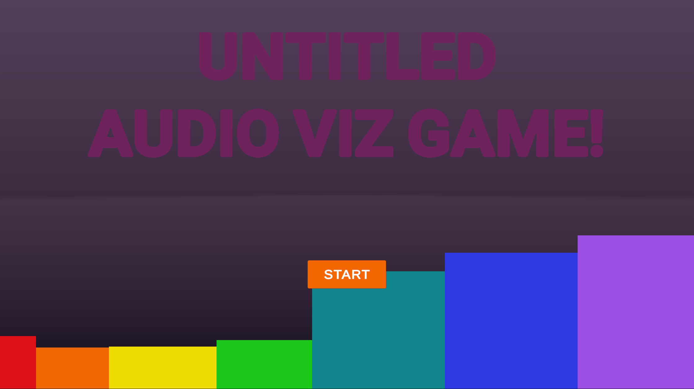

# Audio Viz Game

Made in Unity 2022.3.19.f1 by me to try and teach myself more Unity.

## Description
A silly little 2D game about making music from various beats, based on a "mood". Explores Audio Visualization animation via scale, color, and triggers. Explores audio and layering. Explores particle effects. 

## Outline / Scenes

* Attract
* Mood Picker
    * Happy
    * Sad
    * Vibing
* Low Beat
* Mid Beat
* High Beat
* Conclusion

### Sound Credits

* Mostly free sounds from Looperman.com
* Other tunes I own.
* 'Sad Little Piano Tune' - from [Robbnix](https://freesound.org/people/Robbnix/sounds/685321/) @ Freesound.org